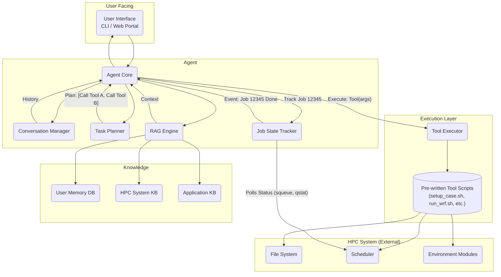

# JobSherpa System Architecture

This document outlines the system architecture for the JobSherpa AI agent, designed to be modular, portable, and secure.

## Architecture Diagram

## Component Breakdown

### 1. User Interface (UI)
-   **Responsibility:** Captures user input (prompts) and displays agent output.
-   **Implementation:** Begins as a CLI, with a long-term goal of a web portal. This component is a thin client that interacts directly with the `Agent Core`.

### 2. Agent Core
-   **Responsibility:** The central orchestrator. It manages the main application loop, taking user input and coordinating all other internal agent components to produce a response or execute a task.

### 3. Conversation Manager (CM)
-   **Responsibility:** Maintains the state and history of the current conversation, providing necessary context for follow-up interactions.

### 4. RAG Engine (Retrieval-Augmented Generation)
-   **Responsibility:** The "brain" of the agent. It enriches user prompts with contextual information retrieved from the various Knowledge Bases before sending them to the LLM for processing. This allows the agent to reason about the user's request using specific, up-to-date information.

### 5. Knowledge Bases (KBs)
-   **Responsibility:** Modular and swappable sources of information.
    -   **User Memory DB:** A persistent database storing user-specific preferences, project paths, and interaction history. This gives the agent memory.
    -   **HPC System KB:** Contains structured data (e.g., YAML files) defining system-specific details like job schedulers, partitions, and available modules. Essential for portability.
    -   **Application KB:** Contains "recipes" for running scientific applications. Defines which tools to use, their required arguments, and how to parse output.

### 6. Task Planner (TP)
-   **Responsibility:** Translates the high-level goal from the `Agent Core` (e.g., "run a WRF simulation") into a concrete, sequential plan of tool calls (e.g., `[call setup_wrf_case.sh, call submit_job.sh]`).

### 7. Job State Tracker (JST)
-   **Responsibility:** A stateful service that manages asynchronous HPC jobs.
-   **Function:**
    1.  Receives a Job ID from the `Agent Core` upon submission.
    2.  Maintains a list of active jobs it needs to monitor.
    3.  Intelligently polls the HPC scheduler for the status of *only* the active jobs (e.g., `squeue --job <ID>`).
    4.  Upon detecting a job completion event, it performs final checks (exit code, output files) and sends a notification event back to the `Agent Core`.

### 8. Execution Layer
-   **Responsibility:** A security and abstraction layer that separates the agent's reasoning from the direct execution of system commands.
-   **Tool Executor (TE):** A dispatcher that receives a specific tool command from the `Agent Core` (e.g., `run_wrf.sh --nodes 4`). It validates that the requested tool exists and then executes it with the provided arguments. It does *not* execute arbitrary commands.
-   **Pre-written Tool Scripts:** A library of static, developer-written shell scripts (e.g., `.sh`, `.py`) that serve as the agent's "tools". These scripts are robust, tested, and define the specific actions the agent is allowed to perform on the HPC system. The agent's intelligence lies in choosing the correct tool and providing the correct dynamic arguments.
